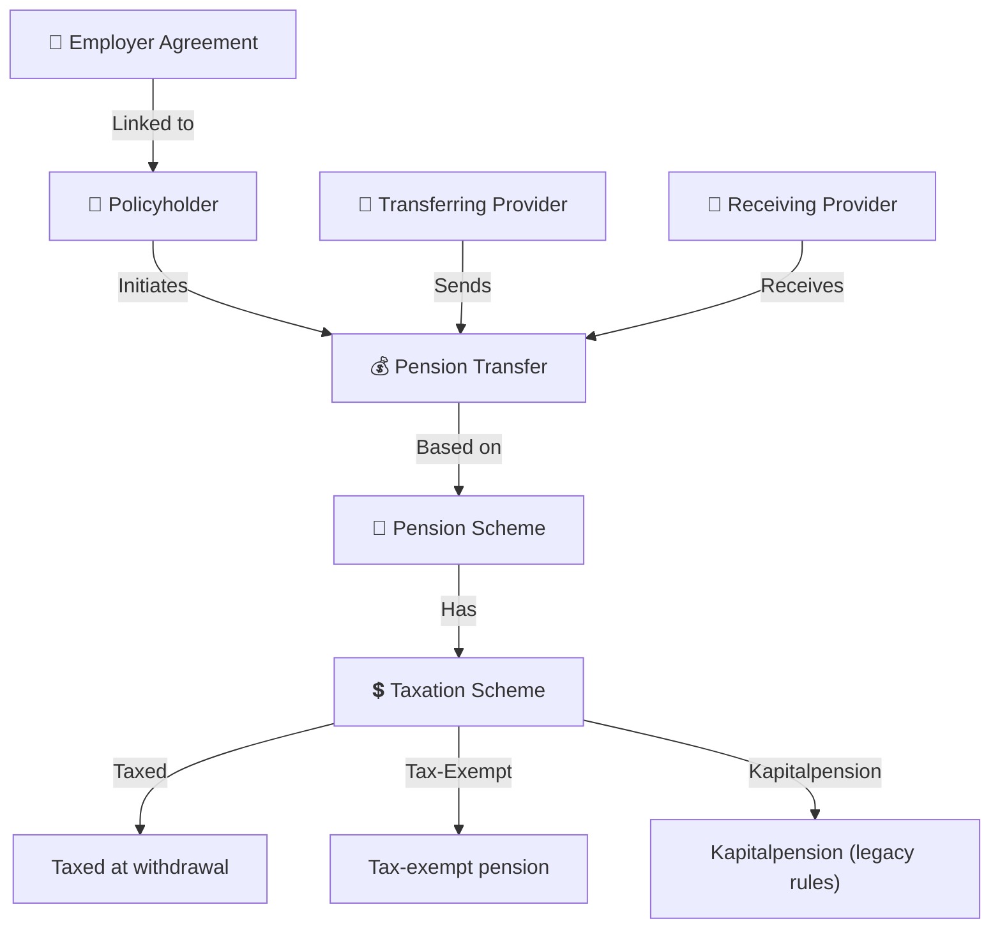
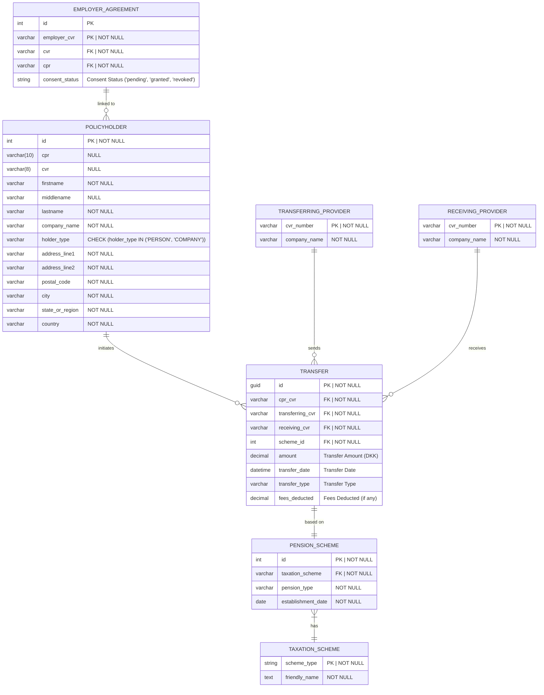

# opentransfer
A hobby project to use actor-model concept on pension fund transfers

```mermaid
graph TD;
    Policyholder["🧑 Policyholder"] -->|Initiates| Transfer["💰 Pension Transfer"];
    TransferringProvider["🏦 Transferring Provider"] -->|Sends| Transfer;
    ReceivingProvider["🏦 Receiving Provider"] -->|Receives| Transfer;
    Transfer -->|Based on| PensionScheme["📜 Pension Scheme"];
    PensionScheme -->|Has| TaxationScheme["💲 Taxation Scheme"];
    EmployerAgreement["📄 Employer Agreement"] -->|Linked to| Policyholder;

    %% Fixed Values for Taxation Scheme
    TaxationScheme -->|Taxed| Taxed["Taxed at withdrawal"];
    TaxationScheme -->|Tax-Exempt| TaxExempt["Tax-exempt pension"];
    TaxationScheme -->|Kapitalpension| CapitalPension["Kapitalpension (legacy rules)"];
```

## E/R Diagram

```mermaid
erDiagram
    POLICYHOLDER {
        int id "PK | NOT NULL"
        varchar(10) cpr "NULL"
        varchar(8) cvr  "NULL"
        varchar firstname "NOT NULL"
        varchar middlename "NULL"
        varchar lastname "NOT NULL"
        varchar company_name "NOT NULL"
        varchar holder_type "CHECK (holder_type IN ('PERSON', 'COMPANY'))"
        varchar address_line1 "NOT NULL"
        varchar address_line2 "NOT NULL"
        varchar postal_code "NOT NULL"
        varchar city "NOT NULL"
        varchar state_or_region "NOT NULL"
        varchar country "NOT NULL"
    }
    
    TRANSFERRING_PROVIDER {
        varchar cvr_number "PK | NOT NULL"
        varchar company_name "NOT NULL"
    }

    RECEIVING_PROVIDER {
        varchar cvr_number "PK | NOT NULL"
        varchar company_name "NOT NULL"
    }

    PENSION_SCHEME {
        int id "PK | NOT NULL"
        varchar taxation_scheme "FK | NOT NULL"
        varchar pension_type "NOT NULL"
        date establishment_date "NOT NULL"
    }

    TAXATION_SCHEME {
        string scheme_type "PK | NOT NULL"
        text friendly_name "NOT NULL"
    }

    TRANSFER {
        guid id "PK | NOT NULL"
        varchar cpr_cvr "FK | NOT NULL"
        varchar transferring_cvr "FK | NOT NULL"
        varchar receiving_cvr "FK | NOT NULL"
        int scheme_id "FK | NOT NULL"
        decimal amount "Transfer Amount (DKK)"
        datetime transfer_date "Transfer Date"
        varchar transfer_type "Transfer Type"
        decimal fees_deducted "Fees Deducted (if any)"
    }

    EMPLOYER_AGREEMENT {
        int id "PK"
        varchar employer_cvr "PK | NOT NULL"
        varchar cvr "FK | NOT NULL"
        varchar cpr "FK | NOT NULL"
        string consent_status "Consent Status ('pending', 'granted', 'revoked')"
    }

    %% Relationships
    POLICYHOLDER ||--o{ TRANSFER : "initiates"
    TRANSFERRING_PROVIDER ||--o{ TRANSFER : "sends"
    RECEIVING_PROVIDER ||--o{ TRANSFER : "receives"
    TRANSFER ||--|| PENSION_SCHEME : "based on"
    EMPLOYER_AGREEMENT ||--o{ POLICYHOLDER : "linked to"
    PENSION_SCHEME }|--|| TAXATION_SCHEME : "has"
```
